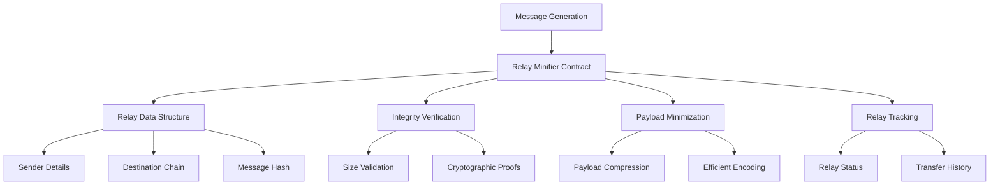

# Decentralized Relay Minifier

A high-performance blockchain solution for optimizing cross-chain message relays on the Stacks blockchain. The system efficiently manages, validates, and minimizes message transmission overhead while maintaining cryptographic integrity.

## Overview

Decentralized Relay Minifier enables users to:
- Create compact cross-chain message relays
- Verify message integrity
- Minimize payload transmission costs
- Track relay status and history
- Optimize inter-blockchain communication

The system is particularly valuable for:
- Blockchain interoperability
- Cross-chain messaging protocols
- Decentralized communication networks
- Layer 2 scaling solutions
- Efficient data transmission

## Architecture

The system leverages a specialized relay contract that manages message relay operations with minimal overhead.



## Contract Documentation

### Relay Minifier Contract

The main contract (`relay-minifier.clar`) handles cross-chain message relay optimization.

#### Key Data Structures
- `relays`: Stores core relay information
- `relay-history`: Tracks relay transfer history
- Supports efficient message transmission

#### Design Principles
- Minimal payload overhead
- Cryptographic message validation
- Decentralized relay management

## Getting Started

### Prerequisites
- Clarinet
- Stacks wallet for deployment

### Installation
1. Clone the repository
2. Install dependencies with Clarinet
3. Deploy contract to desired network

### Basic Usage

```clarity
;; Create a new relay message
(contract-call? .relay-minifier create-relay 
    "ethereum" 
    0x1234abcd 
    u256)

;; Confirm an existing relay
(contract-call? .relay-minifier confirm-relay 
    u0)
```

## Function Reference

### Public Functions

#### create-relay
```clarity
(define-public (create-relay
    (destination-chain (string-ascii 64))
    (message-hash (buff 32))
    (payload-size uint))
```

#### confirm-relay
```clarity
(define-public (confirm-relay
    (relay-id uint))
```

### Read-Only Functions

#### get-relay
```clarity
(define-read-only (get-relay (relay-id uint)))
```

## Development

### Testing
Run the test suite using Clarinet:
```bash
clarinet test
```

### Local Development
1. Start Clarinet console:
```bash
clarinet console
```
2. Deploy contract:
```bash
(contract-call? .relay-minifier ...)
```

## Security Considerations

### Limitations
- Message hash limited to 32 bytes
- Payload size restricted to 1KB
- No built-in encryption for relay messages

### Best Practices
- Validate message integrity before relay
- Use secure hash algorithms
- Minimize payload size
- Implement additional validation in consuming contracts
- Monitor relay confirmations

### Error Handling
The contract includes comprehensive error codes:
- `ERR-UNAUTHORIZED-RELAY (u100)`
- `ERR-INVALID-MESSAGE (u101)`
- `ERR-RELAY-NOT-FOUND (u102)`
- `ERR-INVALID-PROOF (u103)`
- `ERR-RELAY-LIMIT-EXCEEDED (u104)`